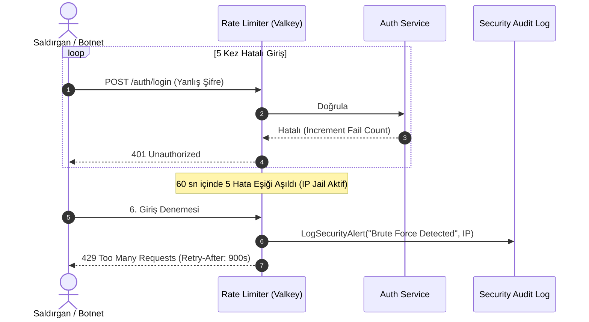

# KÖTÜYE KULLANIM VE GÜVENLİK TEHDİT SENARYOLARI (ABUSE CASES)

**Proje:** demo-project — Bireysel Zaman & Görev Yönetim Platformu (To-Do App)  
**Tarih:** 19 Eylül 2026  
**Sürüm:** v1.0.0  
**SDLC Fazı:** Aşama 02 (Gereksinim Analizi) — Adım A5 (Abuse Cases & RTM İzlenebilirlik)  
**Rol:** Saldırgan Güvenlik & QA Mühendisi (Offensive Security & QA Engineer)  
**Girdi Belgeleri:** [SRS.md](file:///C:/Users/burak/OneDrive/Masaüstü/demo-project/SRS.md), [USER_STORIES.md](file:///C:/Users/burak/OneDrive/Masaüstü/demo-project/USER_STORIES.md)  
**Statü:** **ONAYLANDI (Quality Gate Geçildi)**  

---

## 1. YÖNETİCİ ÖZETİ VE TEHDİT ANALİZİ YAKLAŞIMI

Bu doküman, sistemin yalnızca beklenen kullanıcı davranışlarına (Happy Path) değil; kötü niyetli aktörlerin, saldırganların ve otomatik botların sistemi manipüle etme, veri sızdırma veya hizmeti aksatma girişimlerine (**Abuse Cases / Misuse Cases**) karşı savunma mekanizmalarını tanımlar.

OWASP API Security Top 10 (2023) ve MITRE ATT&CK matrisi referans alınarak 6 kritik kötüye kullanım vektörü ve sistemin aktif savunma (defense-in-depth) protokolü modellenmiştir.

---

## 2. KAPSAMLI ABUSE CASE (KÖTÜYE KULLANIM) SENARYOLARI

### [AC-001] Kaba Kuvvet (Brute-Force) & Credential Stuffing Saldırısı
- **Saldırgan Profili:** Harici Siber Saldırgan / Otomatik Botnet.
- **Hedef Bileşen:** `POST /api/v1/auth/login` (Identity Context).
- **Saldırı Senaryosu:**  
  Saldırgan, sızdırılmış parola listelerini kullanarak bir kullanıcının veya rastgele e-posta adreslerinin parolasını tahmin etmek için saniyede yüzlerce HTTP POST isteği gönderir.
- **Sistem Savunma Protokolü (Defense Action):**
  1. **Hız Sınırlaması (Token Bucket / Sliding Window):** Valkey üzerinde IP ve e-posta bazında bağımsız sayaçlar tutulur.
  2. **IP Jail (Geçici Engelleme):** Aynı IP'den 60 saniye içinde 5 başarısız deneme tespit edildiğinde; sistem kimlik doğrulama katmanına inmeden isteği derhal `HTTP 429 Too Many Requests` ile keser ve `Retry-After: 900` (15 dakika) başlığı döner.
  3. **Argon2id Bellek Yükü:** Parola hashleme fonksiyonunun bellek-zorluğu (`m=65536, t=3, p=4`), saldırganın GPU/ASIC kümeleriyle paralel deneme yapma maliyetini astronomik seviyeye çıkararak brute-force'u anlamsız kılar.
  4. **Bilgi Sızıntısı Engeli:** Hatalı denemelerde "E-posta bulunamadı" veya "Şifre yanlış" ayrımı yapılmaz; sabit `HTTP 401 Unauthorized ("Geçersiz kimlik bilgileri")` dönülür.

---

### [AC-002] Yetkisiz Nesne Erişimi (IDOR / BOLA - Broken Object-Level Authorization)
- **Saldırgan Profili:** Sistemde geçerli hesabı olan Kötü Niyetli İç Kullanıcı (`user_A`).
- **Hedef Bileşen:** `GET /api/v1/tasks/:id`, `PUT /api/v1/tasks/:id`, `DELETE /api/v1/tasks/:id`.
- **Saldırı Senaryosu:**  
  Saldırgan, kendi JWT token'ı ile oturum açtıktan sonra HTTP istek parametresindeki görev ID'sini değiştirerek (örn: kendi görevi `task-101` iken `task-999` yaparak) başka bir kullanıcının görevlerini okumaya, değiştirmeye veya silmeye çalışır.
- **Sistem Savunma Protokolü (Defense Action):**
  1. **Zorunlu Tenant İzolasyonu:** API katmanında hiçbir SQL sorgusu doğrudan `id = :task_id` filtresiyle çalıştırılamaz.
  2. **Drizzle ORM Guard Kuralı:** Tüm sorgular `WHERE id = :task_id AND user_id = :authenticated_user_id` bileşik şartı ile mühürlenir.
  3. **Varlık Gizleme (Stealth Defense):** Başka bir kullanıcıya ait bir ID ile sorgu yapıldığında sistem `403 Forbidden` yerine **`HTTP 404 Not Found`** yanıtı döner. Böylece saldırgan o ID'ye sahip bir görevin sistemde var olup olmadığını dahi keşfedemez.

---

### [AC-003] JWT Manipülasyonu, İmza Taklidi (None Algorithm) ve Süresi Dolmuş Token
- **Saldırgan Profili:** Man-in-the-Middle (MitM) Saldırganı veya Token Ele Geçiren Kullanıcı.
- **Hedef Bileşen:** Tüm Korumalı API Uç Noktaları (`/api/v1/*`).
- **Saldırı Senaryosu:**  
  Saldırgan JWT header kısmındaki algoritmayı `"alg": "none"` olarak değiştirerek imzasız token ile istek atar veya süresi dolmuş eski bir Access/Refresh token'ı yeniden kullanmayı (replay attack) dener.
- **Sistem Savunma Protokolü (Defense Action):**
  1. **Katı Algoritma Doğrulaması:** Backend JWT doğrulayıcısı yalnızca açıkça tanımlanmış simetrik/asimetrik algoritmayı (HS256/RS256) kabul eder; `"none"` algoritması içeren tüm token'lar anında reddedilir.
  2. **Kısa Ömürlü Token:** Access token ömrü kesin olarak **15 dakika** ile sınırlıdır.
  3. **Valkey Token Kara Listesi (Blacklist):** Kullanıcı oturumu kapattığında veya şifre sıfırladığında, Refresh Token anında Valkey kara listesine eklenir. Gelen istekteki token kara listedeyse sistem `HTTP 401 Unauthorized` ile isteği düşürür.

---

### [AC-004] DoS & Kaynak Tüketimi (Resource Exhaustion / Payload Flooding)
- **Saldırgan Profili:** Dağıtık Bot veya Kötü Niyetli Kullanıcı.
- **Hedef Bileşen:** `POST /api/v1/tasks`, `POST /api/v1/profile/export`.
- **Saldırı Senaryosu:**  
  Saldırgan veritabanını şişirmek veya bellek tüketimi yaratarak sunucuyu çökertmek amacıyla 10 MB'lık görev başlıkları gönderir, bir döngüde 50.000 görev oluşturur veya peş peşe yüzlerce ağır JSON/CSV veri dışa aktarma talebi fırlatır.
- **Sistem Savunma Protokolü (Defense Action):**
  1. **Katı Gövde Limiti (Body Parser Limit):** Fastify ingress katmanında JSON payload boyutu maksimum **100 KB** ile sınırlanır; üzerindeki istekler `HTTP 413 Payload Too Large` ile kesilir.
  2. **Maksimum Kota Sınırı:** Bir kullanıcının aktif görev sayısı **1.000** ile sınırlandırılmıştır (`EX-TASK-001B`). 1.001. görevde `HTTP 422 Unprocessable Entity` dönülür.
  3. **Ağır İşlem Kotası:** Veri dışa aktarma (export) servisi kullanıcı başına 24 saatte **en fazla 3 kez** çalıştırılabilir (`HTTP 429 Too Many Requests`).

---

### [AC-005] Unutulma Hakkı Bypassı & Silinmiş Veriye Erişim Girişimi
- **Saldırgan Profili:** Eski Hesap Sahibi veya Hesabı Ele Geçirmeye Çalışan Saldırgan.
- **Hedef Bileşen:** `POST /api/v1/auth/login`, `GET /api/v1/tasks` (Silinmiş Hesap).
- **Saldırı Senaryosu:**  
  Kullanıcı hesabını silme talebinde bulunduktan sonra (`PENDING_DELETION`), eski token'ları kullanarak veya 30 günlük süre dolduktan sonra silinen görev kayıtlarına erişmeyi dener.
- **Sistem Savunma Protokolü (Defense Action):**
  1. **Anında Oturum İptali:** Hesap silme talebi verildiği milisaniyede tüm aktif JWT session'ları iptal edilir ve kullanıcının `status` değeri `PENDING_DELETION` yapılır.
  2. **Giriş Engeli:** `PENDING_DELETION` durumundaki bir hesapla oturum açılmak istendiğinde doğrudan giriş engellenir; yalnızca "Hesabınız silinme sürecindedir, iptal etmek için destek ile iletişime geçin" bilgilendirmesi sunulur.
  3. **Kriptografik İmha (Crypto-shredding):** 30. günün sonunda çalışan imha worker'ı kullanıcının veritabanı kayıtlarını silmekle kalmaz; kullanıcıya özel şifreleme anahtarını (KMS DEK) kalıcı olarak yok eder. Eski veritabanı yedeklerinde kalıntı olsa dahi anahtar yok edildiği için veri matematiksel olarak okunamaz.

---

### [AC-006] Asenkron Bildirim Spam'i & Kuyruk Zehirleme (Queue Poisoning)
- **Saldırgan Profili:** Dışarıdan Tetikleyen Manipülatif Aktör.
- **Hedef Bileşen:** BullMQ Hatırlatıcı Kuyruğu & E-posta Bildirim Çıkışı.
- **Saldırı Senaryosu:**  
  Saldırgan sürekli geçmişe veya saniyelik aralıklara hatırlatıcı kurarak Amazon SES e-posta kotasını tüketmeye ve sistemin dış bildirim itibarını (reputation) düşürerek kara listeye (spamhaus) aldırmaya çalışır.
- **Sistem Savunma Protokolü (Defense Action):**
  1. **Geçmiş Zaman Validasyonu:** Vade tarihi ve hatırlatıcı zamanı geçmişe ayarlanamaz (`due_date >= NOW()`).
  2. **Görev Başına Tekil Hatırlatıcı:** Bir göreve aynı anda yalnızca 1 aktif hatırlatıcı atanabilir; yeni hatırlatıcı eskisini ezer (idempotent).
  3. **Zombi Görev Kontrolü:** BullMQ worker bildirim göndermeden hemen önce görevin veritabanındaki güncel durumunu sorgular; görev tamamlanmış (`COMPLETED`) veya silinmişse e-posta atmadan işi sessizce sonlandırır.

---

## 3. DOĞRULAMA VE KALİTE KAPISI (QUALITY GATE SIGN-OFF)

- [x] **Brute-Force & IP Jail Protokolü:** 60 sn'de 5 hata, 15 dk IP engeli (`HTTP 429`), Argon2id karma zorluğu tanımlandı.
- [x] **IDOR / BOLA Kalkanı:** Zorunlu tenant izolasyonu (`WHERE user_id = :auth_user`) ve `HTTP 404 Not Found` gizleme kuralı netleştirildi.
- [x] **JWT Güvenliği:** 15 dk Access Token, Valkey kara liste, None algoritma reddi belgelendi.
- [x] **DoS & Kota Koruması:** 100 KB payload sınırı, 1.000 görev limiti, 24 saatte 3 export limiti modellendi.
- [x] **Test Edilebilirlik:** Tüm abuse case senaryoları OWASP ZAP, K6 ve Postman sızma testleriyle doğrulanabilir olarak yapılandırıldı.

**Offensive Security Mühendisi:** Security Analyst  
**Statü:** **ONAYLANDI (Abuse Cases Tamamlandı — RTM Matrisine Entegre Edildi)**
