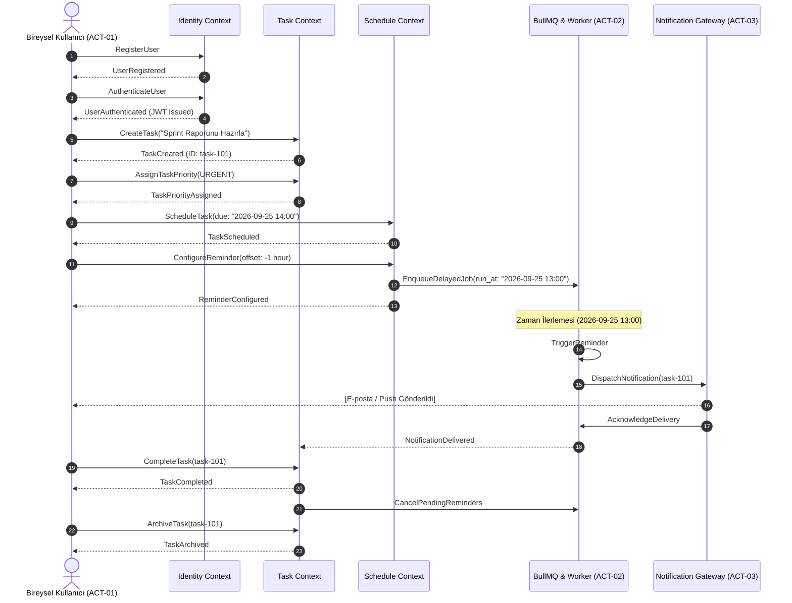

# DOMAİN OLAYLARI VE EVENT STORMING ANALİZİ (DOMAIN EVENTS)

**Proje:** demo-project — Bireysel Zaman & Görev Yönetim Platformu (To-Do App)  
**Tarih:** 19 Eylül 2026  
**Sürüm:** v1.0.0  
**SDLC Fazı:** Aşama 02 (Gereksinim Analizi) — Adım A1 (Event Storming & Bilgi Çıkarımı)  
**Metodoloji:** Domain-Driven Design (DDD) & Event Storming  
**Girdi Belgesi:** [PROJECT_CHARTER.md](file:///C:/Users/burak/OneDrive/Masaüstü/demo-project/PROJECT_CHARTER.md)  
**Statü:** **ONAYLANDI (Quality Gate Geçildi)**  

---

## 1. EVENT STORMING VE DOMAIN MODELİNE GİRİŞ

Bu doküman, `demo-project` (Bireysel Zaman ve Görev Yönetim Platformu) için Domain-Driven Design (DDD) taktiksel kalıpları ve Event Storming metodolojisi kullanılarak hazırlanmıştır. Sistem; kullanıcı kimliği, görev yaşam döngüsü, zaman planlama ve bildirim yönetimi olmak üzere 4 temel **Bounded Context** etrafında modellenmiştir.

### Temel Prensipler
- **Domain Event:** İş alanında meydana gelmiş, değiştirilemez (immutable), geçmiş zaman kipiyle (`Noun + PastVerb`) adlandırılan kritik olaylar.
- **Komut (Command):** Bir aktör veya sistem tarafından Aggregate üzerinde durum değişikliği başlatmak üzere gönderilen emir kipi ifadeler (`Verb + Noun`).
- **İş Kuralı & İlke (Policy / Invariant / Guard):** Bir komutun işletilerek event üretmesi için sağlanması zorunlu olan mantıksal ön koşullar.

---

## 2. BİRİNCİL VE İKİNCİL AKTÖRLER (ACTORS)

Sistem sınırları içinde veya çevresinde komut tetikleyen aktörler:

| Aktör Kodu | Aktör Adı | Tip | Rol ve Sistem Etkileşimi |
| :---: | :--- | :--- | :--- |
| **ACT-01** | **Bireysel Kullanıcı (Individual User)** | İnsan (Son Kullanıcı) | Görev oluşturan, planlayan, önceliklendiren, etiketleyen ve tamamlayan birincil hak sahibi aktör. |
| **ACT-02** | **Sistem Zamanlayıcısı (Cron & Worker System)** | Otonom Arka Plan Servisi | Gecikmeli hatırlatıcıları (BullMQ), günlük/haftalık periyodik tetikleyicileri ve 30 günlük hard-delete veri imhasını yürüten sistem. |
| **ACT-03** | **Dış Bildirim Servisi (Notification Gateway)** | Harici Sistem / API | Zamanı gelen görev uyarılarını e-posta (Amazon SES) veya tarayıcı Web Push ile son kullanıcıya ileten dış sağlayıcı. |
| **ACT-04** | **Sistem Yöneticisi (System Admin / Auditor)** | İnsan (Teknik Aktör) | Sistem sağlığını, P95 gecikmelerini, hata loglarını ve güvenlik audit izlerini denetleyen teknik yetkili. |

---

## 3. BOUNDED CONTEXT BAZINDA DOMAIN EVENTS, KOMUTLAR VE İŞ KURALLARI

```
[Aktör] ──(Komut Gönderir)──> [Aggregate / Guard Check] ──(Olay Üretir)──> [Domain Event] ──(Tetikler)──> [Policy / Tepki]
```

### 3.1. Identity & Profile Bounded Context (Kimlik & Kullanıcı Aggregate)

Kullanıcının kayıt, oturum, güvenlik, veri dışa aktarma ve unutulma hakkı süreçlerini yönetir.

| No | Komut (Command) | Tetikleyen Aktör | Üretilen Domain Event | İş Kuralları, Kısıtlar ve Guard Koşulları (Policies / Invariants) |
| :---: | :--- | :--- | :--- | :--- |
| **1** | `RegisterUser` | ACT-01 (Kullanıcı) | `UserRegistered` | - E-posta adresi sistemde benzersiz (unique) ve geçerli RFC 5322 formatında olmalıdır.<br>- Parola en az 8 karakter, 1 büyük harf, 1 rakam ve 1 özel karakter içermelidir.<br>- Parola bellekte tutulmadan doğrudan **Argon2id** ile hash'lenmelidir. |
| **2** | `AuthenticateUser` | ACT-01 (Kullanıcı) | `UserAuthenticated` | - Kullanıcı hesabı aktif olmalı (`status == ACTIVE`).<br>- Son 1 dakikada aynı IP veya hesaptan 5'ten fazla başarısız deneme olmamalıdır (Rate Limit Guard).<br>- Başarılı doğrulamada JWT Access (15 dk) ve Refresh Token (7 gün) üretilir. |
| **3** | `FailUserAuthentication` | ACT-01 (Kullanıcı) | `UserAuthenticationFailed` | - Parola veya e-posta eşleşmediğinde tetiklenir.<br>- Güvenlik gereği "Kullanıcı bulunamadı" veya "Şifre yanlış" ayrımı yapılmadan genel hata mesajı dönülür. Başarısız deneme sayacı Valkey'de artırılır. |
| **4** | `RequestAccountDeletion` | ACT-01 (Kullanıcı) | `AccountDeletionRequested` | - Kullanıcının aktif oturum doğrulaması ve parola teyidi gereklidir.<br>- Hesap anında devre dışı bırakılır (Soft Delete: `status = PENDING_DELETION`).<br>- KVKK/GDPR uyarınca 30 günlük cayma süresi (grace period) başlatılır. |
| **5** | `PurgeUserData` | ACT-02 (Zamanlayıcı) | `UserDataPurged` | - Hesabın `PENDING_DELETION` durumunda kalış süresi tam 30 günü (720 saat) doldurmuş olmalıdır.<br>- Kullanıcının tüm görevleri, etiketleri ve kişisel verileri veritabanından kalıcı olarak silinir (Hard Delete / Crypto-shredding). |
| **6** | `ExportUserData` | ACT-01 (Kullanıcı) | `UserDataExported` | - Kullanıcı hesabının aktif olması gerekir.<br>- GDPR Madde 20 uyarınca kullanıcının tüm verileri JSON veya CSV formatında tekil bir arşiv dosyası olarak üretilir. Son 24 saatte en fazla 3 kez dışa aktarım yapılabilir. |

---

### 3.2. Task Lifecycle Bounded Context (Görev Aggregate)

Görevlerin oluşturulması, içerik güncellemeleri, etiketlenmesi, önceliklendirilmesi ve tamamlanma akışını yönetir.

| No | Komut (Command) | Tetikleyen Aktör | Üretilen Domain Event | İş Kuralları, Kısıtlar ve Guard Koşulları (Policies / Invariants) |
| :---: | :--- | :--- | :--- | :--- |
| **7** | `CreateTask` | ACT-01 (Kullanıcı) | `TaskCreated` | - Görev başlığı zorunludur, boş olamaz ve 1 - 255 karakter arasında olmalıdır.<br>- Görev varsayılan olarak `TODO` (Yapılacak) durumunda ve `MEDIUM` öncelikle başlatılır.<br>- Bir kullanıcının aktif (tamamlanmamış) görev sayısı 1.000 sınırını aşamaz. |
| **8** | `UpdateTaskDetails` | ACT-01 (Kullanıcı) | `TaskDetailsUpdated` | - Görev sadece oluşturan kullanıcıya (`user_id == authenticated_user_id`) ait olmalıdır (IDOR Guard).<br>- Arşivlenmiş (`ARCHIVED`) görevlerin başlık veya açıklaması güncellenemez; önce arşivden çıkarılmalıdır. |
| **9** | `AssignTaskPriority` | ACT-01 (Kullanıcı) | `TaskPriorityAssigned` | - Öncelik seviyesi yalnızca geçerli enum değerleri olabilir: `LOW`, `MEDIUM`, `HIGH`, `URGENT`. |
| **10** | `AttachTagToTask` | ACT-01 (Kullanıcı) | `TagAttachedToTask` | - Etiket adı 1 - 30 karakter olmalı ve alfasayısal karakterler içermelidir.<br>- Bir göreve en fazla 10 adet etiket eklenebilir. Aynı etiket bir göreve mükerrer eklenemez. |
| **11** | `DetachTagFromTask` | ACT-01 (Kullanıcı) | `TagDetachedFromTask` | - Çıkarılmak istenen etiket göreve önceden iliştirilmiş olmalıdır. |
| **12** | `StartTask` | ACT-01 (Kullanıcı) | `TaskStarted` | - Görevin mevcut durumu `TODO` olmalıdır.<br>- Görevin durumu `IN_PROGRESS` (Devam Ediyor) olarak güncellenir ve `started_at` zaman damgası atanır. |
| **13** | `CompleteTask` | ACT-01 (Kullanıcı) | `TaskCompleted` | - Görev durumu `TODO` veya `IN_PROGRESS` olmalıdır (Zaten tamamlanmış bir görev tekrar tamamlanamaz).<br>- Durum `COMPLETED` olarak güncellenir, `completed_at` zamanı mühürlenir. Varsa bekleyen hatırlatıcılar iptal edilir. |
| **14** | `ArchiveTask` | ACT-01 (Kullanıcı) | `TaskArchived` | - Yalnızca `COMPLETED` durumundaki görevler arşivlenebilir.<br>- Görev durumu `ARCHIVED` olarak işaretlenir; aktif günlük/haftalık panolardan gizlenir. |
| **15** | `DeleteTask` | ACT-01 (Kullanıcı) | `TaskDeleted` | - Görevi sadece sahibi silebilir.<br>- Görev mantıksal olarak silinir (`is_deleted = true`), bağlı hatırlatıcı işleri BullMQ kuyruğundan derhal temizlenir. |

---

### 3.3. Schedule & Calendar Bounded Context (Zaman Planlama Aggregate)

Görevlerin takvim ekseninde (günlük/haftalık/aylık) konumlandırılması ve hatırlatıcı eşiklerini yönetir.

| No | Komut (Command) | Tetikleyen Aktör | Üretilen Domain Event | İş Kuralları, Kısıtlar ve Guard Koşulları (Policies / Invariants) |
| :---: | :--- | :--- | :--- | :--- |
| **16** | `ScheduleTask` | ACT-01 (Kullanıcı) | `TaskScheduled` | - Atanan vade tarihi (`due_date`) geçmiş bir zaman dilimi olamaz (`due_date >= CURRENT_TIMESTAMP`).<br>- Görev, kullanıcının takvim panosunda ilgili gün/hafta/ay dilimine kaydedilir. |
| **17** | `RescheduleTask` | ACT-01 (Kullanıcı) | `TaskRescheduled` | - Yeni tarih geçerli ve gelecekte olmalıdır.<br>- Görevin önceki tarihine ait planlanan BullMQ hatırlatma işi iptal edilir ve yeni tarihe göre yeniden kurulur. |
| **18** | `ConfigureReminder` | ACT-01 (Kullanıcı) | `ReminderConfigured` | - Hatırlatıcı zamanı, görevin vade tarihinden (`due_date`) önce veya en geç vade anında olmalıdır.<br>- BullMQ gecikmeli kuyruğuna (Delayed Job) hedef tetiklenme zamanı hesaplanarak iş eklenir. |
| **19** | `TriggerReminder` | ACT-02 (Zamanlayıcı) | `ReminderTriggered` | - Hatırlatıcı zamanı geldiğinde (`job_run_at <= NOW()`) kuyruk worker'ı tarafından tetiklenir.<br>- Görev henüz tamamlanmamış (`status != COMPLETED`) ve silinmemiş olmalıdır. Görev tamamsa bildirim sessizce düşürülür. |

---

### 3.4. Notification Bounded Context (Bildirim Dağıtımı Aggregate)

Tetiklenen hatırlatıcıların son kullanıcıya iletilmesi ve durum izlemesini yönetir.

| No | Komut (Command) | Tetikleyen Aktör | Üretilen Domain Event | İş Kuralları, Kısıtlar ve Guard Koşulları (Policies / Invariants) |
| :---: | :--- | :--- | :--- | :--- |
| **20** | `DispatchNotification` | ACT-02 (Zamanlayıcı) | `NotificationDispatched` | - Kullanıcının bildirim tercihleri (E-posta açık mı? Push açık mı?) kontrol edilir.<br>- Tercihe göre Amazon SES veya Web Push sağlayıcısına asenkron çağrı gönderilir. |
| **21** | `AcknowledgeDelivery` | ACT-03 (Dış Bildirim) | `NotificationDelivered` | - Dış sağlayıcıdan HTTP 200/202 başarılı teslimat geri bildirimi (webhook veya senkron yanıt) alındığında kaydedilir. |
| **22** | `HandleDeliveryFailure` | ACT-03 (Dış Bildirim) | `NotificationDeliveryFailed` | - Dış sağlayıcı yanıt vermezse veya 5xx hatası dönerse tetiklenir.<br>- Üstel geri çekilme (Exponential Backoff: 1dk, 5dk, 15dk) ile en fazla 3 kez yeniden denenir. 3 başarısızlık sonrasında Dead-Letter Queue'ya aktarılır. |

---

## 4. KRONOLOJİK EVENT AKIŞ DİYAGRAMI (EVENT STORMING FLOW)

Aşağıdaki akış, tipik bir görevin yaşam döngüsünde tetiklenen Domain Event zincirini göstermektedir:



---

## 5. İŞ KURALLARI (BUSINESS POLICIES & GUARDS) ÖZET MATRİSİ

| Kural Kodu | Bounded Context | Guard Koşulu / İş Kuralı | İlgili Domain Event |
| :---: | :--- | :--- | :--- |
| **POL-01** | Identity | Parola salt Argon2id ile hash'lenmeli, düz metin asla loglara ve diske yazılmamalıdır. | `UserRegistered` |
| **POL-02** | Identity | 1 dakikada 5 başarısız girişte IP 15 dakika kilitlenmelidir (Brute-Force Guard). | `UserAuthenticationFailed` |
| **POL-03** | Identity | Hesap silme talebinden sonraki 30 gün boyunca veri silinmez, 30. gün sonunda fiziksel imha zorunludur. | `UserDataPurged` |
| **POL-04** | Task | Kullanıcı yalnızca kendi görevlerine erişebilir ve değiştirebilir (`user_id == auth_user`). | `TaskDetailsUpdated`, `TaskDeleted` |
| **POL-05** | Task | Arşivlenmiş bir görev üzerinde güncelleme yapılamaz, önce arşivden çıkarılmalıdır. | `TaskDetailsUpdated` |
| **POL-06** | Schedule | Görev vade tarihi geçmiş bir zamana ayarlanamaz (`due_date >= NOW()`). | `TaskScheduled` |
| **POL-07** | Schedule | Tamamlanmış (`COMPLETED`) bir görev için zamanı gelen hatırlatıcı bildirim gönderilmez. | `ReminderTriggered` |
| **POL-08** | Notification | Bildirim gönderim hatalarında üstel geri çekilme ile en fazla 3 deneme yapılır. | `NotificationDeliveryFailed` |

---

## 6. DOĞRULAMA VE KALİTE KAPISI (QUALITY GATE SIGN-OFF)

- [x] **En Az 3 Birincil Aktör:** Bireysel Kullanıcı (ACT-01), Zamanlayıcı & Worker (ACT-02), Dış Bildirim Servisi (ACT-03), Sistem Yöneticisi (ACT-04) olmak üzere 4 aktör tanımlandı.
- [x] **En Az 10 Domain Event:** 4 Bounded Context genelinde toplam **22 adet geçmiş zamanlı Domain Event** modellendi.
- [x] **İsimlendirme Standardı:** Tüm event'ler nesne + geçmiş zaman kipiyle (`UserRegistered`, `TaskCreated`, `TaskCompleted`, `ReminderTriggered`) adlandırıldı.
- [x] **Tetikleyici Komutlar:** Her event için yetkili aktör ve tetikleyici komut (`Actor -> Command`) eşleştirildi.
- [x] **Guard Koşulları:** Olaylar arasındaki tüm iş kuralları ve aggregate kısıtları (`POL-01` - `POL-08`) netleştirildi.

**DDD Baş Analisti:** Domain-Driven Design Analyst  
**Statü:** **ONAYLANDI (P2 Aşama 02 Adım A1 Tamamlandı — Adım A2 MoSCoW & Fonksiyonel Gereksinimlere Geçişe Hazır)**
