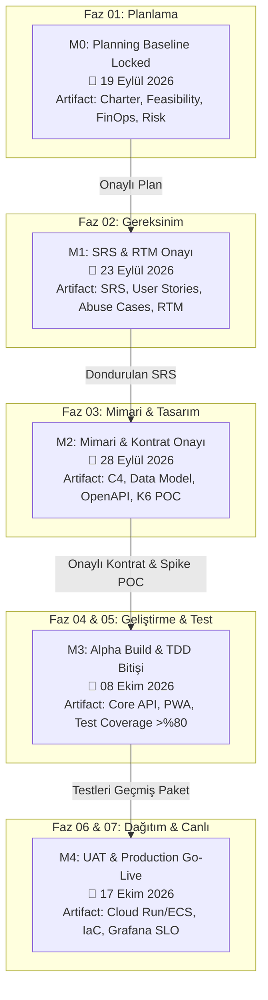

# PROJE İŞ KIRILIM YAPISI (WBS), KİLOMETRE TAŞLARI VE BASELINE YOL HARİTASI (MILESTONE ROADMAP)

**Proje:** demo-project — Bireysel Zaman & Görev Yönetim Platformu (To-Do App)  
**Tarih:** 19 Eylül 2026  
**Sürüm:** v0.1.0-baseline  
**SDLC Fazı:** Aşama 01 (Planlama) — Adım A5 (WBS, Kilometre Taşları ve Baseline Sabitleme)  
**Konsolide Edilen Belgeler:** [PROJECT_CHARTER.md](file:///C:/Users/burak/OneDrive/Masaüstü/demo-project/PROJECT_CHARTER.md), [FEASIBILITY_REPORT.md](file:///C:/Users/burak/OneDrive/Masaüstü/demo-project/FEASIBILITY_REPORT.md), [FINOPS_BUDGET.md](file:///C:/Users/burak/OneDrive/Masaüstü/demo-project/FINOPS_BUDGET.md), [RISK_REGISTER.md](file:///C:/Users/burak/OneDrive/Masaüstü/demo-project/RISK_REGISTER.md)  
**Statü:** **PLANNING BASELINE LOCKED (KİLİTLENDİ)**  

---

## 1. HİYERARŞİK İŞ KIRILIM YAPISI (WORK BREAKDOWN STRUCTURE - WBS)

Aşağıdaki WBS kırılımı, projenin Aşama 01'den Aşama 07'ye kadar olan uçtan uca teslimat yaşam döngüsünü yapılandırır:

### WBS 1.0: Aşama 01 — Stratejik Planlama ve Zemin Hazırlığı [TAMAMLANDI]
- **WBS 1.1:** Kapsam Belirleme ve İnteraktif Mülakat (`PROJECT_CHARTER.md` üretimi, 5 kapsam dışı sınır, SMART KPI'lar).
- **WBS 1.2:** Teknik, Lisans ve Yasal Fizibilite Analizi (`FEASIBILITY_REPORT.md`, MIT/Apache onayı, AGPL/GPL ret, KVKK/GDPR denetimi).
- **WBS 1.3:** FinOps Bulut Maliyet ve Kaynak Bütçelemesi (`FINOPS_BUDGET.md`, AWS/GCP simülasyonu, %20 contingency, $357,60/ay bütçe).
- **WBS 1.4:** Shift-Left Risk Değerlendirmesi & 5×5 Matris (`RISK_REGISTER.md`, 10 risk, 3 kritik fallback action).
- **WBS 1.5:** Baseline Kilitleme ve RACI Matrisi (`MILESTONE_ROADMAP.md`, `v0.1.0` Git sürüm kilidi).

### WBS 2.0: Aşama 02 — Gereksinim Analizi ve Modelleme (19 - 23 Eylül 2026)
- **WBS 2.1:** Yazılım Gereksinim Spesifikasyonu (`docs/analysis/SRS.md`, IEEE 830 standartlarında fonksiyonel ve NFR gereksinimler).
- **WBS 2.2:** Kullanıcı Hikayeleri ve Kabul Kriterleri (`docs/analysis/USER_STORIES.md`, Given-When-Then / Gherkin formatı).
- **WBS 2.3:** Kötüye Kullanım ve Tehdit Senaryoları (`docs/analysis/ABUSE_CASES.md`, IDOR, DoS, brute-force senaryoları).
- **WBS 2.4:** Çift Yönlü İzlenebilirlik Matrisi (`docs/analysis/RTM_MATRIX.md`, Gereksinim - Test - Kod haritalaması).
- **WBS 2.5:** Analiz Kalite Kapısı ve Onay (`analysis-review.html`, Phase Gate 02).

### WBS 3.0: Aşama 03 — Sistem Mimarisi ve Tasarım (24 - 28 Eylül 2026)
- **WBS 3.1:** C4 Mimari Modeli (`docs/architecture/C4_ARCHITECTURE.md`, Context, Container, Component, Code diyagramları).
- **WBS 3.2:** İlişkisel Veri Modeli ve İndeksleme (`docs/architecture/DATA_MODEL.md`, PostgreSQL Drizzle şemaları, PgBouncer pool tasarımı).
- **WBS 3.3:** API ve Asenkron Kuyruk Kontratları (`contracts/openapi.yaml`, `contracts/asyncapi.yaml`, OpenAPI 3.1 & BullMQ schema).
- **WBS 3.4:** STRIDE Tehdit Modellemesi (`docs/architecture/STRIDE_THREAT_MODEL.md`, OWASP Top 10 korumaları).
- **WBS 3.5:** 2 Günlük K6 Spike POC Testi (NestJS + Fastify + Valkey + PostgreSQL üzerinde 500 RPS & P95 < 100ms ampirik kanıtı).

### WBS 4.0: Aşama 04 — Test Odaklı Geliştirme (TDD) ve Çekirdek İnşa (29 Eylül - 08 Ekim 2026)
- **WBS 4.1:** TDD Red Fazı: Birim ve Entegrasyon Testlerinin Kodlanması (Jest / Vitest ile önce başarısız testler).
- **WBS 4.2:** TDD Green Fazı: NestJS Fastify Çekirdek Servislerinin İnşası (Auth, Task, Calendar, Tag, Notification modülleri).
- **WBS 4.3:** TDD Refactor Fazı: Clean Architecture, DRY optimizasyonu ve SonarQube statik kod analizi.
- **WBS 4.4:** Ön Yüz & İstemci Geliştirme: Next.js / TailwindCSS duyarlı Web & PWA arayüzü.
- **WBS 4.5:** Pre-commit ve CI/CD Altyapısı: GitLeaks, Husky, ESLint ve otomatik test pipeline'ı.

### WBS 5.0: Aşama 05 — Kapsamlı Test, Kalite ve Güvenlik Güvencesi (09 - 13 Ekim 2026)
- **WBS 5.1:** Otomatik Test Otomasyonu: %80+ Kod Kapsamı (Code Coverage) denetimi.
- **WBS 5.2:** Yük ve Dayanıklılık Testleri: K6 ile 500 RPS 1 saat sürekli yük ve 1.000 RPS stres/spike testleri.
- **WBS 5.3:** Dinamik Güvenlik ve Zafiyet Taraması: OWASP ZAP DAST taraması ve Trivy container denetimi.
- **WBS 5.4:** Uçtan Uca (E2E) Kabul Testleri: Playwright ile kullanıcı akışları ve PWA offline önbellek testleri.

### WBS 6.0: Aşama 06 — Bulut Altyapısı ve Dağıtım (14 - 16 Ekim 2026)
- **WBS 6.1:** Altyapı Kodlaması (IaC): Terraform ile AWS/GCP (ECS Fargate/Cloud Run, RDS Postgres, Valkey) provizyonu.
- **WBS 6.2:** CI/CD Dağıtım Hattı: GitHub Actions ile Docker imaj üretimi, imzalama (Cosign) ve otomatik deploy.
- **WBS 6.3:** Dağıtım Stratejisi: Sıfır kesintili Blue/Green veya Canary release altyapısı.
- **WBS 6.4:** Dağıtım Sonrası Doğrulama: Otomatik Smoke testleri ve canlı sağlık kontrolü (Healthcheck).

### WBS 7.0: Aşama 07 — Operasyon, SRE ve İzleme (17 Ekim 2026 ve Devamı)
- **WBS 7.1:** Telemetri ve Gözlemlenebilirlik: Prometheus & Grafana ile P95 < 100ms ve %99.9 Uptime SLI/SLO takibi.
- **WBS 7.2:** Olay Müdahale ve Çalıştırma Kitapları (`docs/runbooks/INCIDENT_RESPONSE.md`, `POSTMORTEM_TEMPLATE.md`).
- **WBS 7.3:** FinOps Maliyet Takibi: AWS/GCP bütçe alarmları ve haftalık AI token tüketim raporlaması.

---

## 2. MİLESTONE (KİLOMETRE TAŞI) TAKVİMİ VE BAĞIMLILIKLAR

Proje 4 haftalık çevik sprint takvimine göre planlanmıştır:

| Kod | Kilometre Taşı (Milestone) | Hedef Tarih | Kritik Teslimatlar (Artifacts) | Geçiş Kapısı (Quality Gate Kriteri) |
| :---: | :--- | :---: | :--- | :--- |
| **M0** | **Planning Baseline Locked** | **19 Eylül 2026** | `PROJECT_CHARTER.md`, `FEASIBILITY_REPORT.md`, `FINOPS_BUDGET.md`, `RISK_REGISTER.md`, `MILESTONE_ROADMAP.md` | %20 FinOps contingency, 5 out-of-scope madde, Git `v0.1.0` sürüm kilidi. |
| **M1** | **SRS ve Gereksinim Onayı** | **23 Eylül 2026** | `SRS.md`, `USER_STORIES.md`, `ABUSE_CASES.md`, `RTM_MATRIX.md` | RTM matrisinde yetim (orphan) gereksinim olmaması, Gherkin kabul kriterlerinin tamlığı. |
| **M2** | **Mimari ve Kontrat Onayı** | **28 Eylül 2026** | `C4_ARCHITECTURE.md`, `DATA_MODEL.md`, `openapi.yaml`, K6 POC Raporu | K6 POC'ta 500 RPS'de P95 < 100ms ispatı, DB indeks planı, STRIDE modeli onayı. |
| **M3** | **Alpha Build & TDD Bitişi** | **08 Ekim 2026** | Çekirdek API, Web/PWA Arayüzü, BullMQ Worker, Birim/Entegrasyon Testleri | Sıfır Red test, %80+ Kod Kapsamı, GitLeaks ve SAST taramasında sıfır kritik bulgu. |
| **M4** | **UAT & Canlıya Çıkış (Go-Live)** | **17 Ekim 2026** | Üretim Dağıtımı, Terraform IaC, K6 Yük Raporu, ZAP DAST Raporu, Grafana Panoları | K6 500 RPS yük testi geçişi, DAST sıfır yüksek açık, %99.9 Uptime SLI doğrulama. |

### Milestone Akış Diyagramı (Mermaid)

---

## 3. PAYDAŞ VE SUBAGENT RACI MATRİSİ

RACI Sorumluluk Sınıflandırması:
- **R (Responsible - Sorumlu):** İşi bizzat yapan / icra eden ajan veya kişi.
- **A (Accountable - Hesap Verebilir):** Nihai onayı veren ve sonucundan sorumlu olan makam (Tekil).
- **C (Consulted - Danışılan):** Görüşüne, uzmanlığına veya girdisine başvurulan taraf.
- **I (Informed - Bilgilendirilen):** İlerleme ve kararlar hakkında bilgilendirilen taraf.

| WBS İş Paketi | Proje Sahibi (PO) | finops-risk-analyst | requirements-engineer | system-architect / api-designer | security-architect | database-architect | core-developer | code-reviewer | qa-automation-engineer | cloud-deployer | sre-incident-responder |
| :--- | :---: | :---: | :---: | :---: | :---: | :---: | :---: | :---: | :---: | :---: | :---: |
| **WBS 1.0 (Planlama & Baseline)** | **A** | **R** | C | C | C | C | I | I | I | I | I |
| **WBS 2.0 (Gereksinim & SRS)** | **A** | I | **R** | C | C | C | I | I | C | I | I |
| **WBS 3.0 (Mimari & Tasarım)** | I | C | C | **R** | **R** | **R** | C | I | C | C | C |
| **WBS 4.0 (Geliştirme & TDD)** | I | I | I | C | C | C | **R** | **R** | C | I | I |
| **WBS 5.0 (Test & Güvenlik)** | C | I | I | C | C | I | C | C | **R** | I | I |
| **WBS 6.0 (Bulut Dağıtımı & IaC)** | **A** | C | I | C | C | I | I | I | C | **R** | C |
| **WBS 7.0 (SRE & Bakım/İzleme)** | I | C | I | I | C | C | I | I | I | C | **R** |

---

## 4. BASELINE KİLİTLEME VE KAPSAM DEĞİŞİKLİĞİ YÖNETİMİ (CHANGE CONTROL PROCESS - CCP)

Bu belgenin onaylanması ve Git üzerine `v0.1.0` sürüm kilidinin atılmasıyla birlikte **Proje Planlama Baseline'ı kilitlenmiştir**. Kapsam kaymasını (scope creep), gereksiz bütçe artışlarını ve takvim sapmalarını engellemek için aşağıdaki değişiklik protokolü zorunludur:

### 4.1. Değişiklik Talep Süreci (RFC - Request For Change)
1. **Talep Girişi:** Herhangi bir kapsam genişletme, yeni özellik, teknoloji değişikliği veya mimari revizyon talebi `docs/planning/RFC_TEMPLATE.md` formatında yazılı olarak sunulmalıdır.
2. **3 Boyutlu Etki Analizi:**
   - **FinOps Etkisi:** Aylık $500 tavan bütçesini aşıyor mu?
   - **Takvim Etkisi:** 17 Ekim 2026 Go-Live tarihini öteliyor mu?
   - **Güvenlik/Yasal Etkisi:** KVKK/GDPR uyumunu veya 5 kapsam dışı sınırını bozuyor mu?
3. **Değişiklik Kontrol Kurulu (CCB) Onayı:**
   - Değişiklik ancak Proje Sahibi (Accountable) ve ilgili Baş Mimarların oybirliği ile onaylanırsa kabul edilir.
   - Onaylanmayan hiçbir talep sprint backlog'una veya kod tabanına dahil edilemez.

---

## 5. DOĞRULAMA VE KALİTE KAPISI (QUALITY GATE SIGN-OFF)

- [x] **Aşama 01 Belgeleri Eksiksiz Konsolide Edildi:** Charter, Feasibility, FinOps ve Risk Register sentezlendi.
- [x] **WBS Kırılımı Tamamlandı:** WBS 1.0'dan WBS 7.0'a kadar tüm iş paketleri hiyerarşik olarak tanımlandı.
- [x] **Milestone Takvimi Sabitlendi:** M0'dan M4'e kadar tarihler ve bağımlılıklar visual grafik ile bağlandı.
- [x] **RACI Matrisi Kuruldu:** 12 uzman subagent rolü ve Proje Sahibi için yetki/sorumluluklar tablolandı.
- [x] **Kapsam Değişikliği Protokolü Kilitlendi:** RFC ve Etki Analizi mekanizması devreye alındı.

**Proje Baş Direktörü:** Project Orchestrator  
**Statü:** **ONAYLANDI (SDLC Aşama 01 Tamamlandı — Aşama 02 Gereksinim Analizi'ne Geçiş Onaylandı)**
